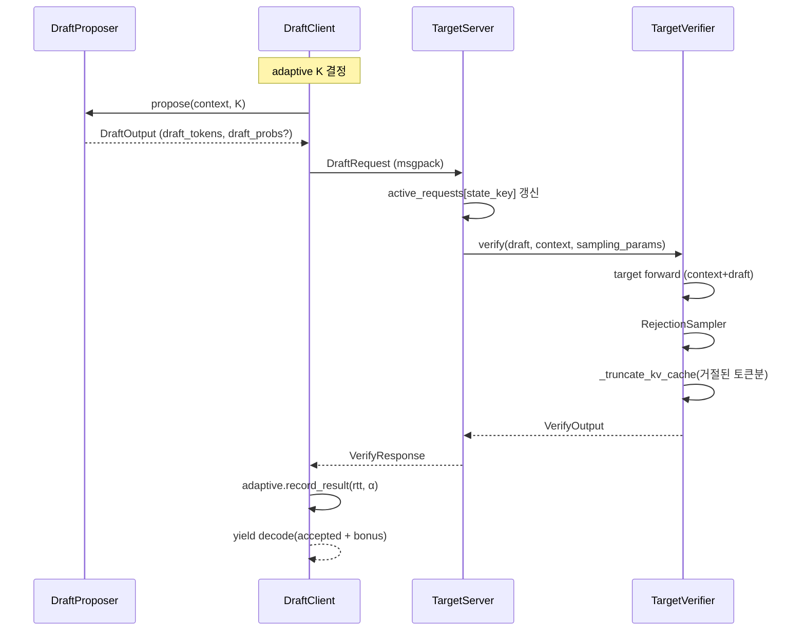

# System Design — Client-Server 아키텍처

[ALGORITHMS](./ALGORITHMS.md) 에서 선택한 Client-Server 변형을 어떻게 구현했는지, 컴포넌트 / 메시지 / 상태 관점에서 정리한다. 각 설계 결정은 [SCENARIOS](./SCENARIOS.md) 의 특정 시나리오/요구에서 도출됐다.

---

## 전체 구성

```
┌──────────────────────────────── Client Process ───────────────────────────────┐
│ ``distspec-client`` (CLI entry)                                               │
│  ┌──────────────────┐   propose()   ┌────────────────────┐                    │
│  │  DraftProposer   │  ───────────▶ │    DraftClient     │                    │
│  │  • N-gram        │               │  (ZMQ DEALER)      │                    │
│  │  • Suffix        │               │                    │                    │
│  │  • EAGLE         │               │  + Adaptive K      │                    │
│  └──────────────────┘               │  + Fault FSM       │                    │
│                                     └─────────┬──────────┘                    │
└───────────────────────────────────────────────┼───────────────────────────────┘
                                                │  DraftRequest  (msgpack)
                                                │  ◀ VerifyResponse
                                                │
┌───────────────────────────────────────────────┼───────────────────────────────┐
│ ``distspec-server`` (CLI entry)               │                               │
│                                     ┌─────────▼──────────┐                    │
│                                     │    TargetServer    │                    │
│                                     │  (ZMQ ROUTER)      │                    │
│                                     │                    │                    │
│                                     │  active_requests[] │                    │
│                                     └─────────┬──────────┘                    │
│                                     verify()  │                               │
│                                     ┌─────────▼──────────┐                    │
│                                     │    BaseVerifier    │  (abstract)        │
│                                     └───┬────────────┬───┘                    │
│                                 ┌───────▼────┐  ┌────▼────────┐               │
│                                 │ HfVerifier │  │ VllmVerifier │              │
│                                 │ (Phase 1)  │  │ (Phase 2)    │              │
│                                 │ transformers│  │ vllm.LLM     │             │
│                                 │ + KV in-mem │  │ PagedAttn    │             │
│                                 └─────────────┘  └──────────────┘             │
└───────────────────────────────────────────────────────────────────────────────┘
```

- **Client** = 경량 연산 (draft 생성) + 네트워크 I/O + 상태 기계. `distspec-client` 로 1급 CLI 노출.
- **Server** = 무거운 target forward + rejection sampling + per-request 상태 캐시. `distspec-server` 로 1급 CLI 노출.
- **Backend 추상화**: 서버는 `BaseVerifier` 에만 의존하고 실제 실행은 `HfVerifier` (Phase 1, HuggingFace transformers) 또는 `VllmVerifier` (Phase 2, vLLM LLMEngine) 가 담당. `ServerConfig.backend="hf"|"vllm"` 또는 CLI `--backend` 로 선택.
- 둘 사이에는 ZMQ DEALER ↔ ROUTER 소켓만 놓여 있고, 메시지는 모두 msgpack 으로 직렬화.

---

## 메시지 프로토콜

### 정의 위치

모든 메시지는 `prototype/common/protocol.py` 의 `@dataclass` 로 정의되어 있고, `MsgpackEncoder/Decoder` 로 양방향 변환된다.

| 메시지 | 방향 | 주요 필드 |
|---|---|---|
| `DraftRequest` | C → S | `request_id`, `prompt_tokens` (첫 요청만), `draft_tokens`, `draft_probs` (EAGLE), `sampling_params`, `kv_cache_info` |
| `VerifyResponse` | S → C | `request_id`, `accepted_tokens`, `num_accepted`, `bonus_token`, `hidden_states`, `finished` |
| `HealthCheck` / `HealthResponse` | C ↔ S | server 가용성 확인 |

### 직렬화

- **msgspec.msgpack** 우선, 없으면 JSON fallback.
- Tensor/ndarray 는 `{_tensor: True, data: bytes, dtype, shape}` 로 내려가고 수신측에서 `np.frombuffer` → `torch.from_numpy` 복원.
- 제네릭 dataclass 는 `_type: ClassName` 태그로 올라가 `MsgpackDecoder.TYPE_MAP` 에서 재구성.

### 한 스텝 시퀀스



---

## ZMQ 토폴로지

### 왜 ZMQ 인가

- **비동기 메시지 큐 내장**: `asyncio` 와 통합 (`zmq.asyncio`).
- **Multi-client 자동 라우팅**: ROUTER 소켓이 각 peer 의 identity 를 유지해 응답을 정확히 되돌려준다. 직접 구현하면 상당량의 상태 관리가 필요.
- **Frame 기반**: `recv_multipart()` 로 `[identity, empty, payload]` 구조를 자연스럽게 표현.

### DEALER ↔ ROUTER 패턴

| 역할 | 소켓 타입 | 특성 |
|---|---|---|
| Client | `DEALER` | identity 를 자동 부여받음 (또는 명시), 라운드 로빈으로 메시지 송신 |
| Server | `ROUTER` | 수신한 peer identity 를 보존해 응답 시 사용 |

- **Scenario 2 (다중 클라이언트) 해결**: 서버는 `frames[0]` 을 identity 로 써서 `active_requests[f"{identity}:{request_id}"]` 키로 상태를 격리 유지. 별도의 세션 테이블 관리가 불필요.

### 타임아웃 / 재시도

- `RCVTIMEO` / `SNDTIMEO` 를 `config.timeout * 1000` (ms) 로 설정.
- 타임아웃 시 `zmq.error.Again` 예외 → `DraftClient.generate()` 에서 재시도, 연속 실패는 [ADAPTIVE_CONTROL](./ADAPTIVE_CONTROL.md) 의 FSM 으로 전파.

---

## 상태 관리

### Client 측 상태

```python
DraftClient:
    draft_proposer        # 상태 있음 (Suffix tree) 또는 없음 (N-gram)
    adaptive_controller   # RTT / α 히스토리 (deque)
    _request_count        # request_id 생성용
```

Proposer 와 controller 는 별개로 리셋 가능 (`reset()`). 요청이 끝나도 controller 히스토리는 유지되어 다음 요청에 이어서 사용된다 — **RTT/α 특성은 네트워크 환경에 묶여 있지 한 요청에 묶이지 않는다**.

### Server 측 상태

```python
TargetServer:
    active_requests: Dict[str, RequestState]  # key = f"{client_id}:{request_id}"
    verifier: TargetVerifier                  # 모델 + KV cache
    metrics: ServerMetrics
```

**`RequestState`**: 각 요청의 `prompt_tokens + generated_tokens` 를 누적. 클라이언트는 첫 요청에만 prompt 를 싣고, 이후 요청은 `draft_tokens` 만 전송 → 네트워크 트래픽 절약.

**KV cache**: Backend 별로 처리 방식이 다릅니다.
- **HfVerifier (Phase 1)**: 매 verify 호출마다 `context + draft` 전체를 forward (단순, correctness 우선). Phase 1 의 `_truncate_kv_cache` 는 HF Cache 객체 호환성 이슈로 `use_cache=False` 로 간소화됨.
- **VllmVerifier (Phase 2)**: vLLM 의 `KVCacheManager` 가 PagedAttention block table 로 KV 를 관리. `enable_prefix_caching=True` 로 연속된 요청의 공통 context 를 재사용하므로 같은 대화에서 두 번째 요청부터는 forward 비용이 극적으로 감소 (실측 246ms → 5ms).

### 암묵적 전제

- **Sticky routing**: 같은 요청은 같은 서버 인스턴스에 붙어야 한다. Phase 1 은 단일 서버 가정.
- **단일 유저 대화 단위**: `request_id` 는 스트림 ID. 여러 턴 대화를 동일 `request_id` 로 묶으면 KV cache 누적 혜택을 얻는다.

이 두 전제는 Phase 2 (vLLM 통합) 에서 vLLM 의 request scheduler 와 block manager 로 자연스럽게 대체된다.

---

## 디렉토리 / 파일 매핑

| 디렉토리 | 책임 | 주요 파일 |
|---|---|---|
| `src/distspec/common/` | 데이터 계약 (프로토콜 + 설정 + sampling 유틸 + confidence) | `protocol.py`, `config.py`, `sampling.py`, `confidence.py` |
| `src/distspec/client/` | Draft 생성 + 통신 + FSM + CLI | `draft_proposer.py`, `draft_client.py`, `fault_tolerant_client.py`, `confidence_client.py`, `cli.py` |
| `src/distspec/server/` | 서버 루프 + backend-agnostic verifier 추상화 | `target_server.py`, `base.py`, `hf_verifier.py`, `vllm_verifier.py` |

**1급 CLI 엔트리 포인트** (`pyproject.toml` 의 `[project.scripts]`):
- `distspec-server` → `distspec.server.target_server:main` — `--backend {hf,vllm}` 으로 실행 시점에 verifier 선택
- `distspec-client` → `distspec.client.cli:main` — `--draft-method {ngram,suffix,eagle}` 로 proposer 선택

**프로그래매틱 사용**:
- 서버: `TargetServer(ServerConfig(backend="vllm", target_model=..., ...))` 를 async context manager 로.
- 클라이언트: `FaultTolerantClient(ClientConfig(...))` 를 async context manager 로 → `generate(prompt)` 이 async generator 로 토큰 스트리밍.

---

## 설계 트레이드오프 요약

| 결정 | 이유 | 트레이드오프 |
|---|---|---|
| ZMQ DEALER/ROUTER | multi-client + async 친화, multi-node 확장 가능 | gRPC 대비 스키마 검증 약함 (msgspec 으로 보완) |
| msgpack over JSON | 이진 포맷, 수치 배열 효율적 | 가독성 낮음 (디버그 시 `jq` 류 툴 안 먹힘) |
| 서버에 context 누적 | 네트워크 절약 + KV cache 재사용 | sticky routing 필요 (Phase 1 한계, Phase 2 에서는 vLLM scheduler 가 해결) |
| **Verifier 추상화** (`BaseVerifier`) | HF → vLLM 교체가 서버 코드 변경 0줄. 같은 `verify()` 시그니처 | 배치/KV 최적화를 backend-specific 경로로 빼야 해 backend 간 동작 차이 존재 |
| Proposer 추상화 | N-gram/Suffix/EAGLE 런타임 교체 | 공통 인터페이스에 맞추느라 각 기법의 고유 최적화 포기 |
| CLI 1급 등록 | `distspec-server`/`distspec-client` 대칭, `pip install -e .` 후 어디서나 | entry point 갱신은 재설치 필요 (editable 이라 실제로는 거의 무해) |

---

**다음 섹션들**:
- Draft 를 어떻게 만드는지: [DRAFT_METHODS](./DRAFT_METHODS.md)
- Target 검증과 분포 보존: [VERIFICATION](./VERIFICATION.md)
- Adaptive K 와 Fault-Tolerant FSM: [ADAPTIVE_CONTROL](./ADAPTIVE_CONTROL.md)
